# shadowless-light
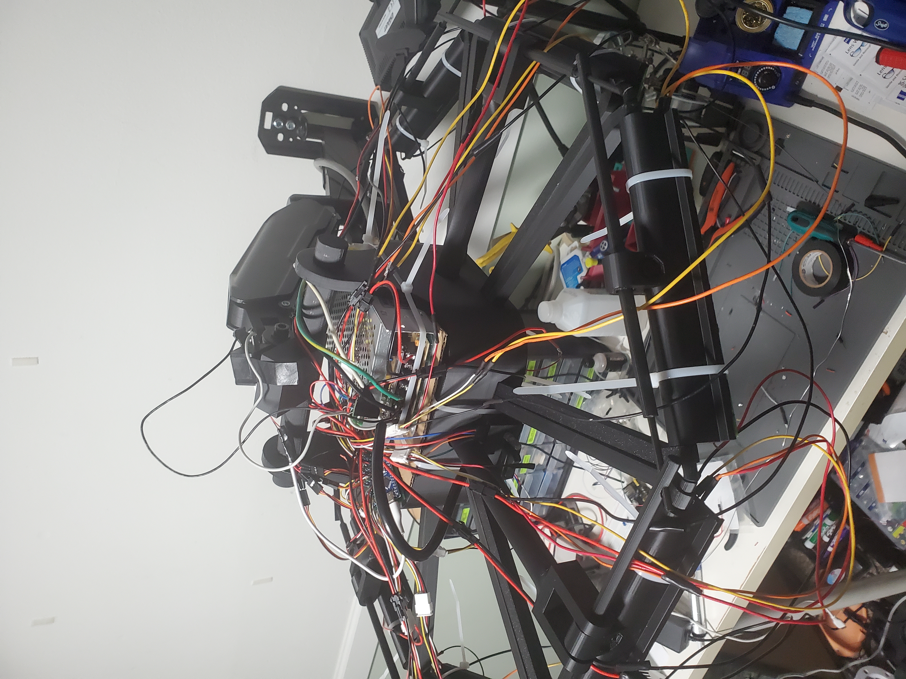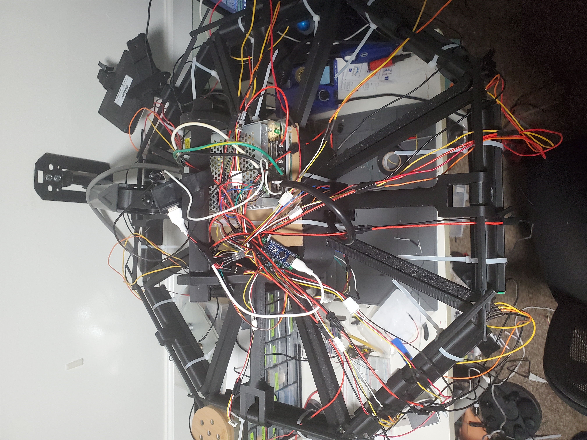
***
## description
{youtube link}  test
this is a desk light designed to not cast a shadow to make working on fine details easier 
it works by having a main light then there is octogon ring around it that has lights and will tilt in and out to make sure every spot has at least one light on it 

| regular light                                      | shadowless ligh                                                       |
|----------------------------------------------------|-----------------------------------------------------------------------|
| 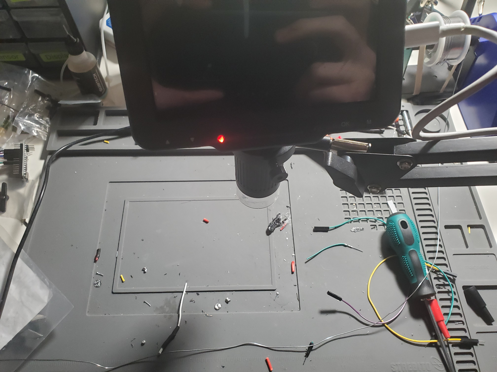 | 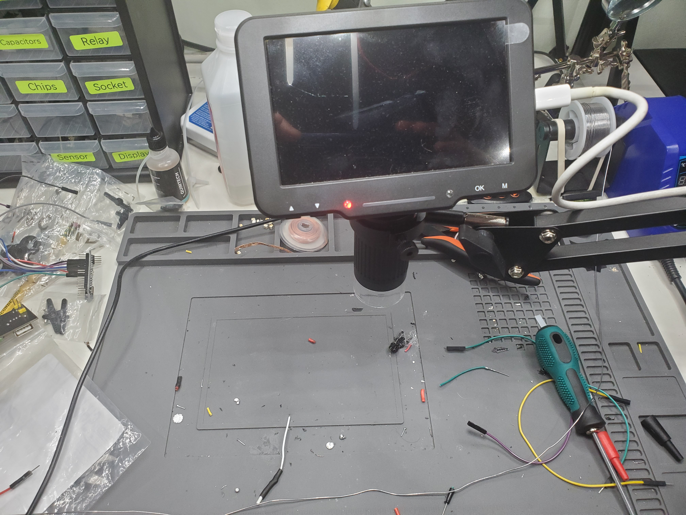 

### use cases
* soldering
* painting fine detail
* just like any kinda of work tbh
### features
* btight
* RGBW
* UV
* adjustable lights
* blind yourself
## assembly
i cover this in the yt video a lot better
***
### 3d print
settings 

| number | name|
| -------- | ------- |
| 1 | hook |
| 1 | main |
| 16 | supports |
| 8 | light |
| 8 | pivoit |
| 8 | push |
| 4 | servo |
| 16 | pin |
| 1 | cover |
### wall 
attatch the stand to the wall the instructions are on the box
### 3d print assembly
* remove suports
* put the hook on stand
* place the main thing on the hook
* place all the 16 suports in the main thing and secure it with the pins
* thread the pivots throught the suports and the lights to make an octogon
* put the servos through the big holes in the main thing
* then thread the push through the top of the light and the servo
* then the goes on top of the main thing
### pcbs
| number | name        |
|--------|-------------|
| 8      | left wing   |
| 8      | right wing  |
| 1      | main        |
| 1      | indicator   |
| 1      | motherboard |
### soldering 
350 c recomended
* solder the 1 left wing light
* solder the 1 right wing light
* use the pad on the side to hold them togeather
* solder wires to the sides of the pcb
* repeate x 8
* main board
  * RGBW the uv 
  * one of the lights needs some help
* mother board 
  * the v line is a cut power cable
* indicator
### arduino
you need to use adruino ide to upload the script to the arduino nano
### servos :(
so i forgot about the servo when making the pcb so there isnt a convinent break out for it so
you need to solder a wire to pin 7 directly then split the wire in to 4 then thats the data wire for the servos and the gnd and power come direcly from the power suply
also i think my servos are too weak so they wernt able to actualy do anyyhing
### assembling electronics
* wings
  * zip tie just like every thing
  * then do that 8 times
* main
  * you guesed it zip ties
* plug in all the things
* power supply
  * connect a 120v ac up to the main thing
  * connect one side to the switch on the front and the other side to one on the things on the 12v rectifer
  * this is another thing i forgot to add to the pcb connect the 12v output to the power wires on the mother board
  * now for the 5v if you have a buck dc to dc converter use that i didnt so i did this
  * connect a wall 5v rectifyer in parralel with the 120vac then plug that in to the the arduino with a usb to usbc
  * however we need to cut this wire then split it in to a bunch of things so that we can power the servos
## documantation
* schemadic 
  * indicator this is used to show if it is on and what value you are adjusting
  * 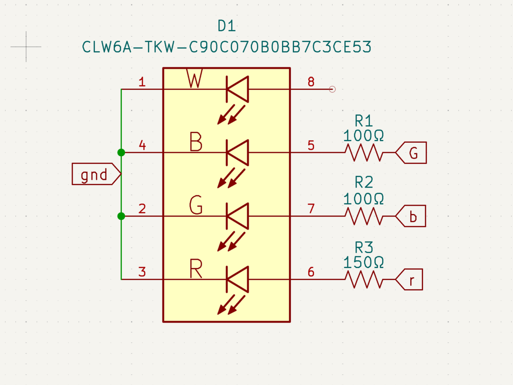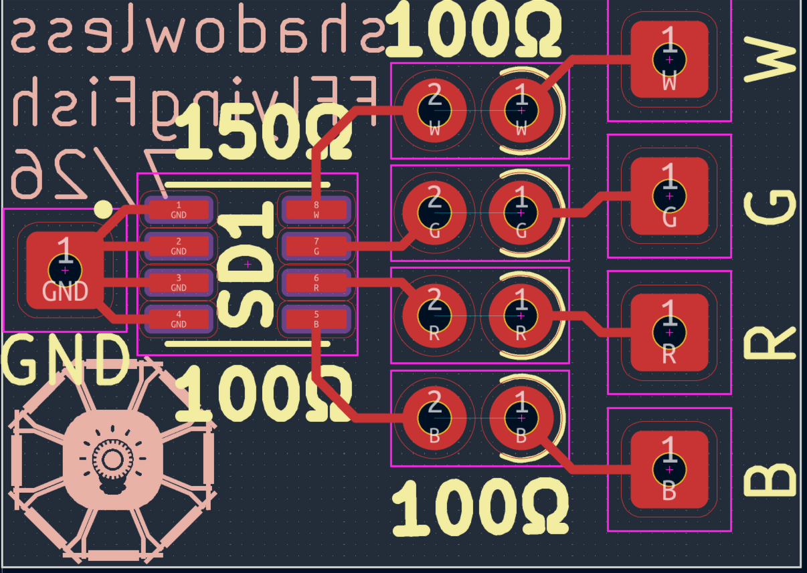
  * right wing 
  * 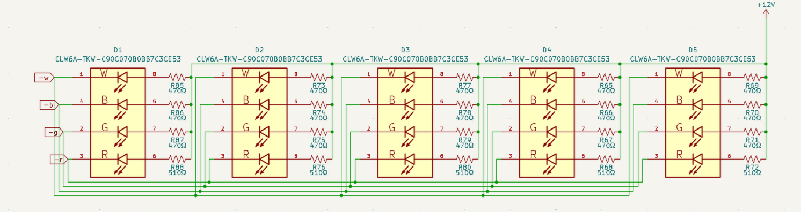
  * 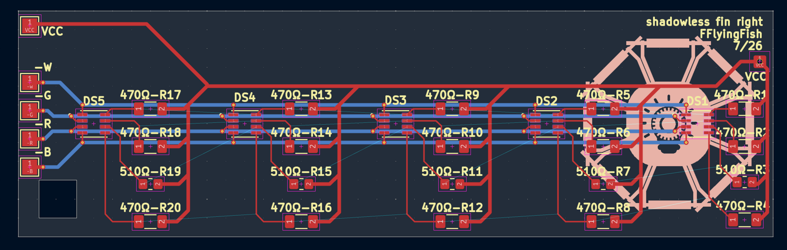
  * left wing
  * 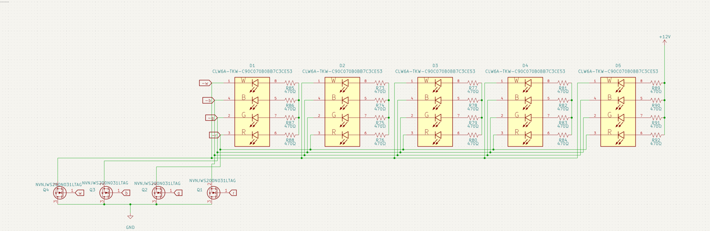
  * 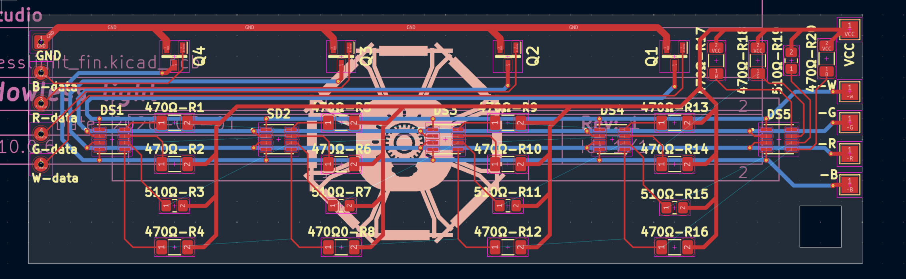
  * motherboard
  * 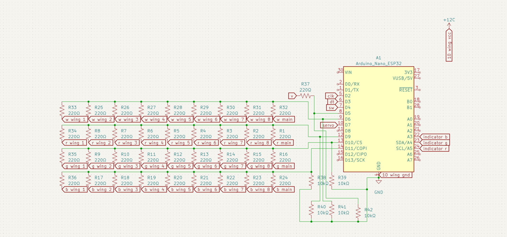
  * 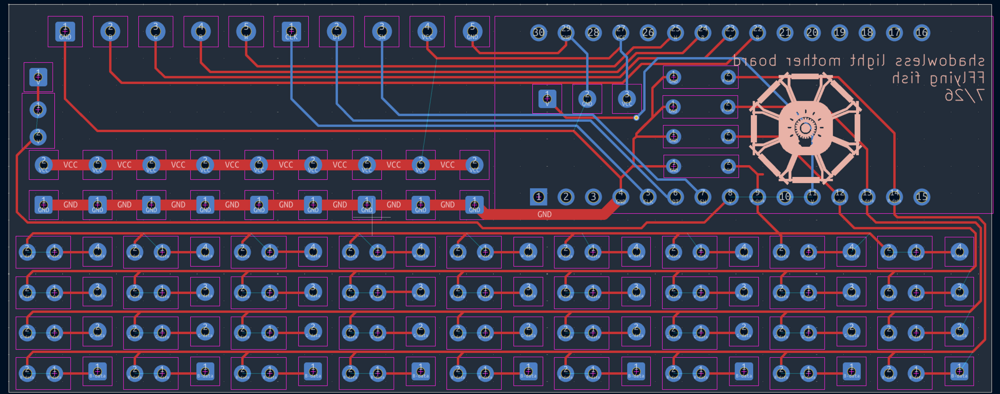
  * main
  * 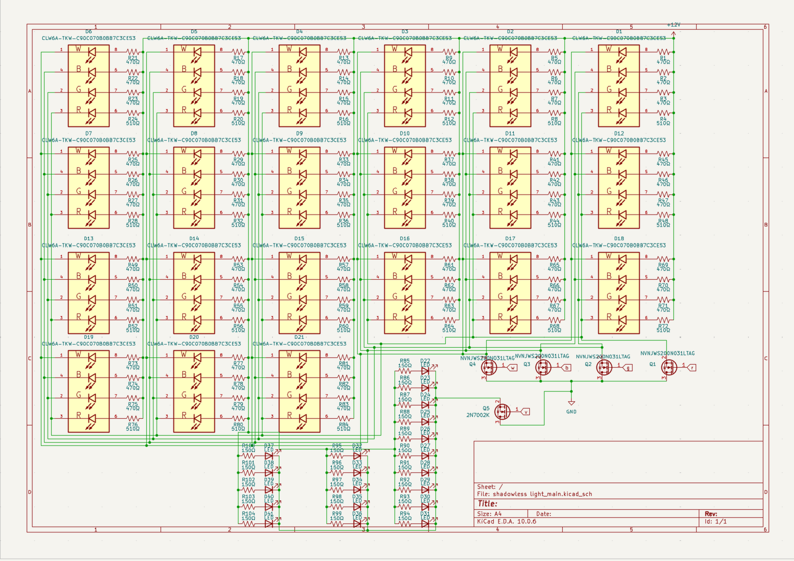
  * 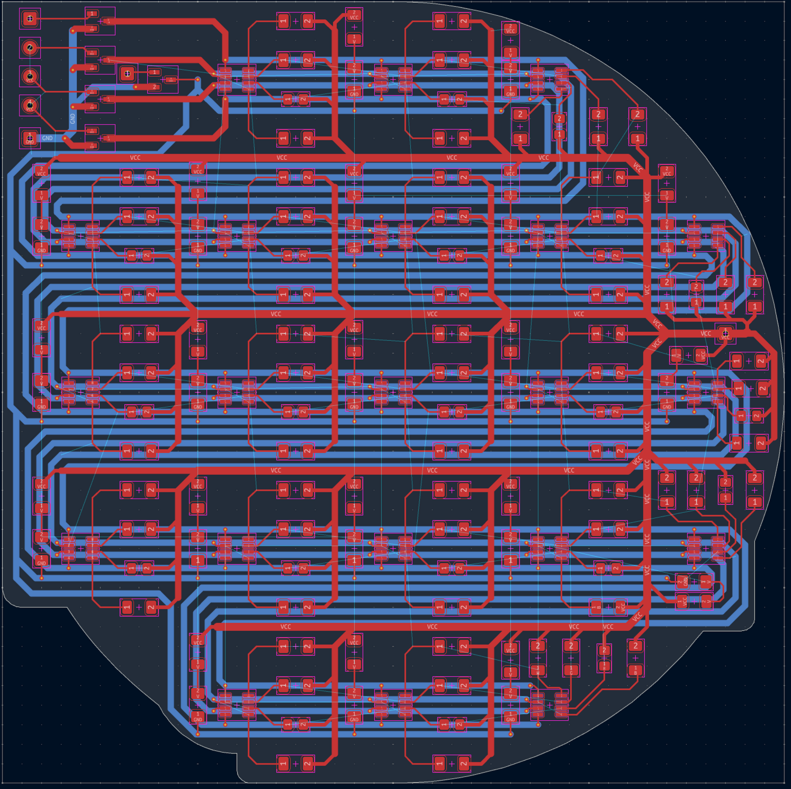
* voltage stuff
  * lights are running at 12v 
  * each light runs at 20mA there is 4 lights in eash light there are 101 lights so 404 individual light + the 20 uv lights all run at 20mA or 0.02A * 424 = 8.48A
  * the 12 has 10A to cover it all
* lumins alot
  * red 4.8 lumens
  * green 10.7 lumens
  * blue 2.2 lumens
  * 10.7 lumens
  * 28.4 lumens per light X 101 = 248.4 lumens at max britness 
* it is suposed to sit about 600mm off your desk
* its about 600mm in total witch ngl i think is too big i might make a smaler one in the futger
## extra
* i am like really bad ar soldering so like half the light dont work 
